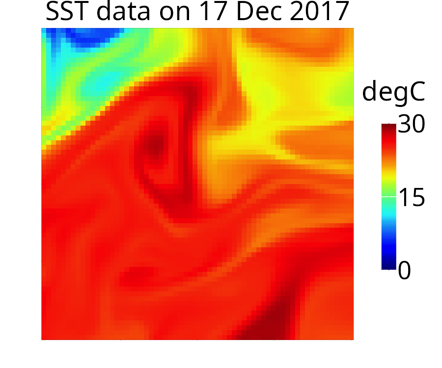
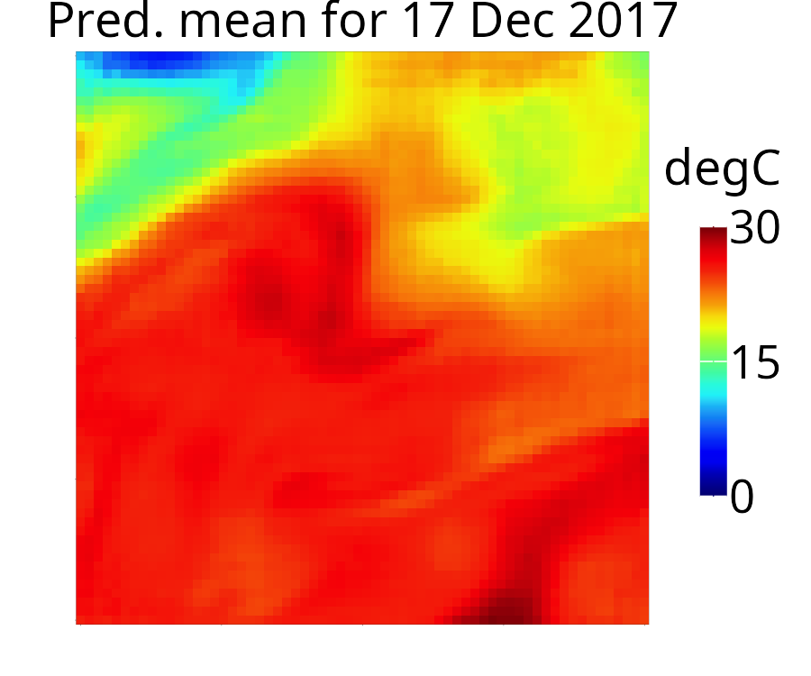
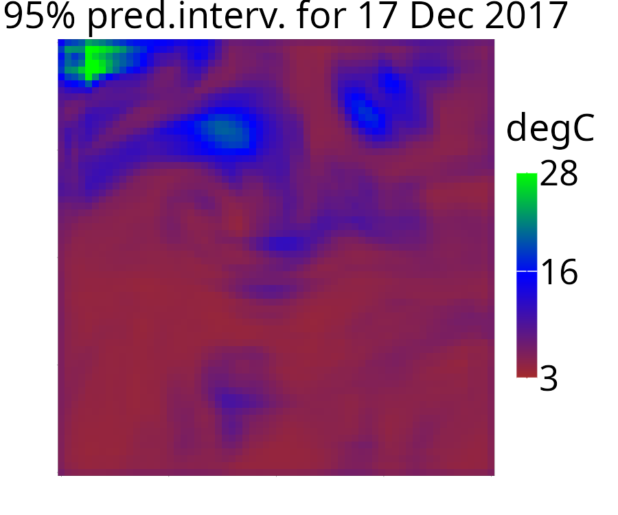
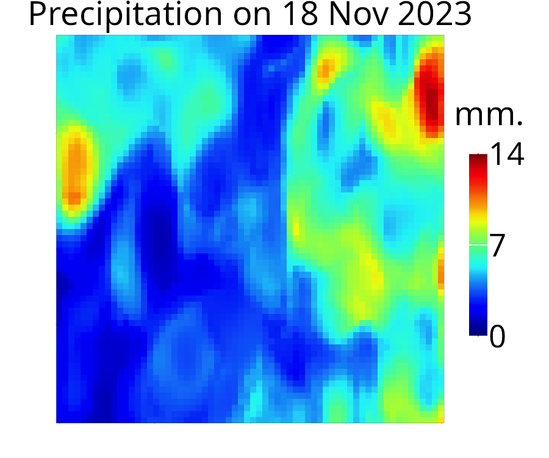
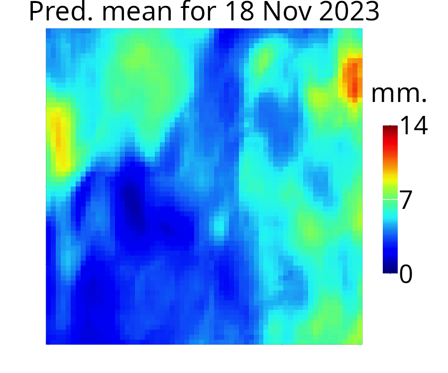
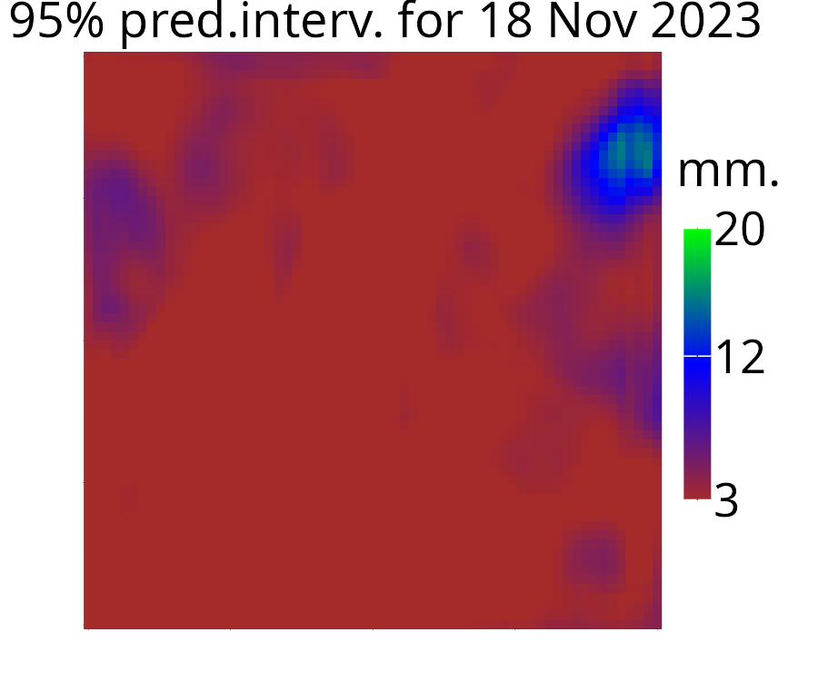

# 🌊 FNO-DSTM: Fourier Neural Operator for Dynamic Spatio-Temporal Modeling

This repository contains the code and workflows used in our **FNO-DSTM** paper titled "**Spatio-temporal modeling with Fourier neural operators**", which combines the Fourier Neural Operator framework with dynamic spatio-temporal modeling for both simulated and real-world data.

---

## ⚙️ Installation

### ✅ Prerequisites
- Python ≥ 3.6
- R installed and available in your system path (for plotting)

### 📦 Setup Instructions

To clone the repository and set up the environment:

```bash
git clone https://github.com/pratiknag/FNO-DSTM.git
cd FNO-DSTM
bash setup.sh
````

> 💡 `setup.sh` installs all dependencies and creates a virtual environment in your current directory. Supported OS: Linux and macOS.

---

## 📈 Reproducing Results

### 🔬 Simulated Experiments: Burgers' Equation

Run the following script to reproduce all plots and results for the Burgers' equation simulation:

```bash
bash run_burger.sh
```

📌 Note:

* The Burgers' equation is solved numerically to generate simulated datasets.
* Results and plots for all comparative models will be saved in the `plots/` directory.
* This script can take time to complete — we recommend running it in the background.

---

### 🌐 Real-World Data Applications

Due to size and privacy constraints, full real-world datasets cannot be uploaded to this repository.

#### 📦 Sample Data Provided:

* SST (Sea Surface Temperature): `datasets/sst_data-6t-sample.npy`
* Precipitation (Interpolated): `datasets/precipitation_interpolated_data-sample.npy`

The precipitation data is spatially interpolated using the Space-Time DeepKriging (STDK) model.

To regenerate the interpolated dataset (optional), run:

```bash
python src/python_scripts/precipitation_interpolation/create_embedding.py
python src/python_scripts/precipitation_interpolation/ST_interpolation.py
```

⚠️ These scripts require the original precipitation dataset, which cannot be shared publicly.

Additional preprocessing utilities:

* `data_preprocessing.py`
* `create_data_for_forecasting.py`

---

### 🛰️ Run Real Data Forecasting Examples

#### Sea Surface Temperature (SST):

```bash
bash run_sst.sh
```

#### Precipitation:

```bash
bash run_precip.sh
```

Both commands will generate forecast plots in the `plots/` directory for all comparative models.

---

## 🧠 Models Compared

This repository supports training and evaluation of:

* ✅ **FNO-DSTM** (ours)
* ✅ CDNN
* ✅ ConvLSTM
* ✅ STDK (Space-Time DeepKriging)

Each model's training script is located in:

```
src/python_scripts/Data_application/
```

Each script has a description of modifiable hyperparameters at the top.

---

## 🖼️ Example Forecasts

### SST Forecasting (FNO-DSTM)

<table>
  <tr>
    <th>True Observation</th>
    <th>Prediction</th>
    <th>95% Forecast Interval</th>
  </tr>
  <tr>
    <td></td>
    <td></td>
    <td></td>
  </tr>
</table>

---

### Precipitation Forecasting (FNO-DSTM)

<table>
  <tr>
    <th>True Observation</th>
    <th>Prediction</th>
    <th>95% Forecast Interval</th>
  </tr>
  <tr>
    <td>
      
    </td>
    <td>
      
    </td>
    <td>
      
    </td>
  </tr>
</table>

---

## 📫 Contact

For access to full datasets or other questions, feel free to reach out:

📧 **[pnag@uow.edu.au](mailto:pnag@uow.edu.au)**

---

## 📜 Citation

If you use this code or approach in your research, please cite the associated paper (Arxiv link to be added later).

---
